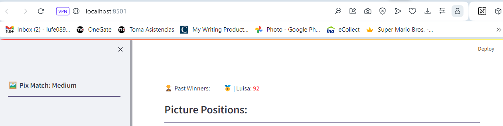

# Ejercicio de migración parte 1
## Familiarizarse y darle mantenimiento a código existente

**Objetivo:** Comprender y mantener un código legado, experimentando la importancia de usar las mejores prácticas en programación para facilitar futuras mejoras y refactorizaciones.
>  **IMPORTANTE**: El conjunto de entregables que produce este ejercicio aportará al 10% del curso que corresponde a la nota del documento escrito teniendo en cuenta los porcentajes de evaluación disponibles al final de este documento en la sección **Criterios de evaluación**

## Preparación e instalación
* Ver el código fuente del proyecto https://github.com/shakamoushie/pixmatch/blob/main/pixmatch.py . Este proyecto tiene un clone del proyecto original
* Interactuar con el juego para entener las funcionalidades principales https://pixmatchgame.streamlit.app
* Instalar el proyecto en su computador local. Escriba desde la línea de comandos y ubicado en la carpeta raíz del proyecto `pip install -r requirements.txt`. Note que si no tiene un ambiente virtual primero debe configurarlo. 
* Ejecutar el juego localmente. Escriba en consola `streamlit pixmatch.py`. Su navegador debería abrir el juego

## Entendimiento de la versión actual
### I. Familiaridad y ajuste con la versión actual del código fuente
1. Localice las partes del código que actúan como puntos de entrada. Para este caso, botones como "New Game" y "Return to Main Page" desencadenan acciones importantes.
2. Agrege comentarios al código actual. Documente las funciones y clases que no tengan comentarios adecuados. Para ello cree un nuevo archivo en este proyecto llamado `pixmatch_refactor.py` que sea una copia del original. Sobre este nuevo archivo hará todos los ajustes. **Tenga encuenta el nuevo nombre para cuando quiera ejecutar el proyecto**.
3. Cree un diagrama de flujo que documente el proceso de juego desde que el usuario da clic en el botón para iniciar el juego hasta que el usuario selecciona una imagen y el sistema verifica si la imagen seleccionada es o no correcta.
     > Agregue el diagrama en la carpeta docs con el nombre `proceso_juego`
3. Agregue en el archivo [requisitos.md](docs/a.requisitos) la lista de requisitos (funcionalidades) que soporta el proyecto actualmente según su análisis.Trate de identificar las funcionalidades principales que soporta el juego a partir de su revisión del código fuente, del uso del juego y de la revisión de la documentación que encuentre.   
>Por ejemplo, un requisito podría ser
> **Gestión de Puntaje y Validación de Respuestas.** El sistema debe ser capaz de gestionar y actualizar el puntaje del jugador en tiempo real, basado en las respuestas del usuario durante el juego. Cada vez que un jugador selecciona una casilla en el tablero de juego, el sistema debe verificar si la selección es correcta o incorrecta comparándola con la imagen objetivo en la barra lateral.
 
4. Relacione fragmentos del código fuente, variables, etc con los requisitos que identificó para resolver el juego. 
   > Complete/Ajuste la tabla disponible en el archivo [`Requisitos2Code.md`](docs/b.requisitos_2_code)

### II. Modificaciones y adiciones
5. Modifique las siguientes funcionalidades, pruébelas para verificar que su cambio no afectó negativamente el funcionamiento ya existente. 
   * Guardar **cuatro** en lugar de tres jugadores en el archivo que almacena el top de puntuación
   * Mostrar los cuatro principales jugadores y sus puntajes encima del tablero en la intefaz gráfica.
   * **Perder el juego**: El usuario puede fallar como máximo al 50%+1 de las imágenes que tiene el tablero. 
   Por ejemplo, un tablero fácil tiene 36 turnos. El usuario solo puede fallar 18 veces. 
   Cuando complete la selección de la figura número 19, el jugador habrá perdido y no podrá jugar más. 
   El usuario deberá volver a la página principal e iniciar un nuevo juego si quiere seguir jugando aunque será una nueva partida.    

> Luego de hecho el ajuste y de probar que el juego funcione bien complete las preguntas disponibles en el archivo [modificar_funciones.md](docs/c.modificacion_funciones)

## Detección de oportunidades de mejora a la calidad
Diligencie la [lista de chequeo](docs/d.lista_chequeo) a partir de su revisión como *desarrollador experto* del código fuente actual. Considere que usted trabaja en una empresa desarrolladora de software como _desarrollador senior_ y que es su responsabilidad asegurar que el código desarrollado por la empresa cumple con las mejores prácticas. 

## Detección de oportunidades para aplicar principios de OOP
Reflexione sobre cómo podría estructurar el código usando clases para mejorar la claridad y mantenibilidad del código. Dado que todavía no tiene tanta experiencia con la programación en Streamlit, imagine que va a reestructurar su aplicación para que funcione en C++. 

Documente su propuesta en el archivo de [mejoras.md](docs/d.mejoras). Su propuesta junto con la detección de oportunidades para mejora de la calidad serán discutidas en la próxima sesión.

## Evaluación
### Criterios

| Entregable                                           | Peso (%) |
|------------------------------------------------------|----------|
| Código comentado en `pixmatch_refactor.py`           | 10       |
| Diagrama de flujo en `proceso_juego` en carpeta docs | 10       |
| Archivo [requisitos.md](docs/a.requisitos) con lista de funcionalidades documentadas | 10       |
| Tabla en [`Requisitos2Code.md`](docs/b.requisitos_2_code) ajustada con relación código-requisitos | 10       |
| Modificaciones funcionales comprobadas en el código, descritas en [modificar_funciones.md](docs/c.modificacion_funciones) | 25       |
| Lista de chequeo completada en [lista_chequeo.md](docs/d.lista_chequeo) | 15       |
| Documentación de ideas para aplicar principios de OOP en [mejoras.md](docs/d.mejoras) | 20       |

### Rúbrica

### 1. Código comentado en `pixmatch_refactor.py`
- **Alto (4.0 - 5.0 puntos):** Todos los métodos y bloques de código complejos tienen comentarios que explican claramente qué hace el código. Se incluyen comentarios para cada función y clase modificadas o añadidas.
- **Intermedio (3.0 - 3.9 puntos):** La mayoría de los métodos y funciones importantes tienen comentarios adecuados, pero algunos bloques de código aún carecen de explicación suficiente o los comentarios son vagos.
- **Bajo (0 - 2.9 puntos):** Pocos o ningún comentario útil presente; solo comentarios triviales o que no añaden claridad al código, como anotaciones obvias o redundantes.

### 2. Diagrama de flujo en `proceso_juego` en carpeta docs
- **Alto (4.0 - 5.0 puntos):** El diagrama de flujo es completo y preciso, representando todos los pasos del proceso de juego desde el inicio hasta la validación de la imagen, incluyendo decisiones y resultados posibles.
- **Intermedio (3.0 - 3.9 puntos):** El diagrama de flujo cubre la mayoría de las partes del proceso de juego, pero omite algunos detalles menores o las conexiones entre algunos pasos no son claras.
- **Bajo (0 - 2.9 puntos):** El diagrama de flujo es incompleto o incorrecto, faltan pasos significativos del proceso de juego o hay errores en la representación de las interacciones.

### 3. Archivo [requisitos.md](docs/a.requisitos) con lista de funcionalidades documentadas
- **Alto (4.0 - 5.0 puntos):** La lista incluye todas las funcionalidades del juego, con descripciones detalladas que reflejan correctamente la implementación y comportamiento actual del sistema.
- **Intermedio (3.0 - 3.9 puntos):** La mayoría de las funcionalidades principales están documentadas con descripciones correctas, aunque algunas funcionalidades secundarias pueden no estar incluidas o detalladas.
- **Bajo (0 - 2.9 puntos):** Muchas funcionalidades clave no están listadas o las descripciones son incorrectas o engañosas respecto a la implementación actual.

### 4. Tabla en [`Requisitos2Code.md`](docs/b.requisitos_2_code) ajustada con relación código-requisitos
- **Alto (4.0 - 5.0 puntos):** La tabla relaciona claramente y de manera exhaustiva fragmentos de código específicos con los requisitos documentados, mostrando una correspondencia directa entre funcionalidad y su implementación.
- **Intermedio (3.0 - 3.9 puntos):** La tabla muestra una relación adecuada entre la mayoría de los requisitos y el código, pero algunas entradas pueden ser vagas o incompletas.
- **Bajo (0 - 2.9 puntos):** La tabla es incompleta o las relaciones entre código y requisitos son incorrectas o demasiado generales.

### 5. Modificaciones funcionales comprobadas en el código, descritas en [modificar_funciones.md](docs/c.modificacion_funciones)
- **Alto (4.0 - 5.0 puntos):** Todas las modificaciones requeridas se implementan correctamente sin introducir errores en el juego; los cambios son validados con pruebas adecuadas y documentadas detalladamente en el archivo.
- **Intermedio (3.0 - 3.9 puntos):** La mayoría de las modificaciones funcionan según lo previsto, pero una o dos pueden no estar completamente implementadas o pueden afectar ligeramente otras funcionalidades.
- **Bajo (0 - 2.9 puntos):** Las modificaciones están incorrectamente implementadas, no se documentan adecuadamente o introducen errores que afectan la funcionalidad existente o no hay evidencia de que no afectan la funcionalidad existente.

### 6. Lista de chequeo completada en [lista_chequeo.md](docs/d.lista_chequeo)
- **Alto (4.0 - 5.0 puntos):** La lista de chequeo está completamente diligenciada con respuestas detalladas que reflejan un análisis crítico.
- **Intermedio (3.0 - 3.9 puntos):** La lista de chequeo está mayormente completa, aunque algunas respuestas pueden ser superficiales o faltar detalles críticos.
- **Bajo (0 - 2.9 puntos):** La lista de chequeo está incompleta, las respuestas son inadecuadas o no muestran un entendimiento del ejercicio realizado.

### 7. Documentación de ideas para aplicar principios de OOP en [mejoras.md](docs/d.mejoras)

- **Alto (4.0 - 5.0 puntos):**
  - **Clases Definidas:** Todas las clases listadas incluyen una descripción del propósito y una justificación que explica su necesidad en el contexto del programa. Cada clase refleja un componente esencial del sistema según los requisitos funcionales.
  - **Métodos Identificados:** Se listan y describen los métodos para cada clase propuesta, especificando las operaciones que realizan.
  - **Diagrama de Clases UML Completo:** El diagrama incluye todas las clases, métodos, atributos y relaciones, siguiendo las normas de representación UML estándar, y muestra la estructura completa del diseño propuesto.
  - **Organización de Archivos:** La estructura de directorios propuesta esta justificada con referencia a prácticas estándar de gestión de proyectos de software.

- **Intermedio (3.0 - 3.9 puntos):**
  - **Clases Definidas:** La mayoría de las clases necesarias están listadas con descripciones del propósito. Algunas justificaciones pueden no detallar completamente la necesidad o importancia de la clase.
  - **Métodos Identificados:** La mayoría de los métodos necesarios están listados con descripciones funcionales, aunque algunos pueden carecer de detalles sobre cómo contribuyen a las funcionalidades de la clase.
  - **Diagrama de Clases UML:** El diagrama incluye la mayoría de las clases y relaciones, pero puede omitir algunos detalles menores o no seguir completamente las normas de representación UML.
  - **Organización de Archivos:** La estructura de directorios propuesta está indicada, pero puede no incluir detalles que expliquen la organización. 

- **Bajo (0 - 2.9 puntos):**
  - **Clases Definidas:** Faltan varias clases importantes o las descripciones y justificaciones son insuficientes para entender la necesidad de las clases.
  - **Métodos Identificados:** Faltan varios métodos importantes o las descripciones son insuficientes para entender sus operaciones o su contribución a la clase.
  - **Diagrama de Clases UML:** El diagrama es incompleto, faltan clases, métodos, atributos o relaciones importantes, o no cumple con las normas de representación UML.
  - **Organización de Archivos:** La estructura de directorios propuesta es inadecuada, falta detalle sobre la ubicación de los componentes o no hay justificación para la organización elegida.